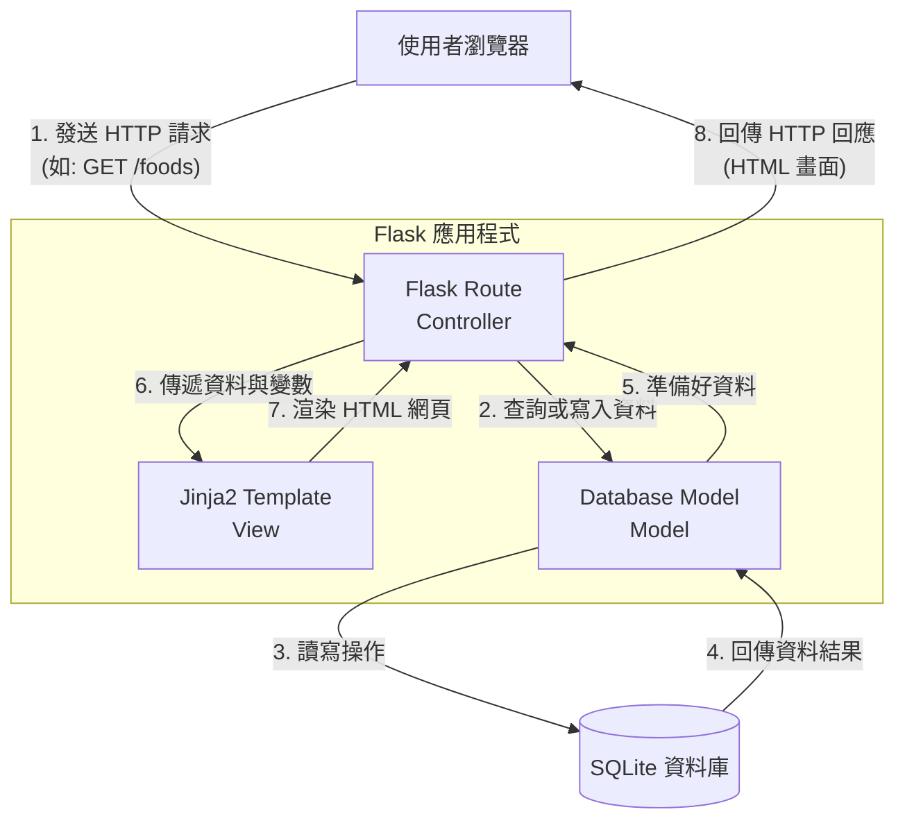

# 系統架構設計 - 校園惜食匹配系統 (Smart Campus Food Matching)

本文件根據 PRD 需求，說明校園惜食匹配系統的技術架構、資料夾結構與關鍵設計決策，幫助開發團隊快速理解系統全貌。

## 1. 技術架構說明

### 選用技術與原因
- **後端框架：Python + Flask**
  - **原因**：Flask 輕量、靈活，適合快速開發 MVP（最小可行性產品）。Python 語言對於開發者來說容易上手，社群資源豐富，適合校園專案。
- **模板引擎：Jinja2**
  - **原因**：與 Flask 完美整合的模板系統，可以直接在後端將資料注入 HTML 網頁中，減少初期還要開發獨立前端 API 的複雜度。
- **資料庫：SQLite**
  - **原因**：無須額外架設資料庫伺服器，資料儲存在單一檔案（`database.db`）中，方便開發、測試與初期部署。

### Flask MVC 模式說明
本專案採用經典的 MVC (Model-View-Controller) 架構概念來組織程式碼：
- **Model（資料模型）**：負責與 SQLite 資料庫溝通，定義資料表結構（例如：使用者、剩食、預約記錄），並處理資料的讀寫邏輯。
- **View（視圖，由 Jinja2 擔任）**：負責畫面渲染。讀取從 Controller 傳來的資料並產生最終的 HTML 呈現給使用者瀏覽或互動。
- **Controller（控制器，由 Flask Routes 擔任）**：負責接收瀏覽器的請求 (Request)，驗證資料，呼叫 Model 取得或更新資料庫，然後再將資料傳遞給 View 進行渲染與回應 (Response)。

---

## 2. 專案資料夾結構

以下是本專案的資料夾結構配置：

```text
smart_campus_food/
├── app/
│   ├── __init__.py      ← 負責初始化 Flask 應用程式與資料庫設定
│   ├── models/          ← (Model) 資料庫模型定義
│   │   ├── user.py      ← 使用者 (餐廳、學生、管理員) 模型
│   │   ├── food.py      ← 剩食餐點模型
│   │   └── order.py     ← 預約訂單模型
│   ├── routes/          ← (Controller) 處理各種網址路由
│   │   ├── auth.py      ← 登入、註冊與驗證邏輯
│   │   ├── food.py      ← 發佈、瀏覽剩食功能的路由
│   │   └── order.py     ← 預約取餐相關的路由
│   ├── templates/       ← (View) Jinja2 HTML 網頁模板
│   │   ├── base.html    ← 共用的版型底圖（如標題列、導覽列）
│   │   ├── index.html   ← 首頁與統計看板
│   │   ├── auth/        ← 登入與註冊頁面
│   │   ├── food/        ← 剩食列表與地圖顯示頁面
│   │   └── order/       ← 預約確認與訂單管理頁面
│   └── static/          ← 靜態資源檔案
│       ├── css/         ← 網頁樣式表 (CSS)
│       ├── js/          ← 前端互動腳本 (JavaScript，如地圖 API 串接)
│       └── images/      ← 圖片資源 (包含預設餐點圖、Logo 等)
├── instance/
│   └── database.db      ← SQLite 實體資料庫檔案 (本地運行產生，不進版控)
├── docs/                ← 專案相關文件存放區 (如 PRD.md, ARCHITECTURE.md)
├── requirements.txt     ← 記錄專案所需的 Python 套件 (如 Flask, SQLAlchemy 等)
└── app.py               ← 專案啟動入口檔案
```

---

## 3. 元件關係圖

以下展示使用者操作網頁時，系統內部元件如何互相協作的流程：



---

## 4. 關鍵設計決策

1. **不採用前後端分離架構**
   - **原因**：為了快速產出 MVP（最小可行性產品），並降低初期開發與部署門檻。使用 Flask 搭配 Jinja2 伺服器端渲染，可以省去設定與獨立維護前端框架（如 React/Vue）的成本，專注於核心業務邏輯。
2. **使用模組化 Blueprint (藍圖) 管理路由**
   - **原因**：將不同功能的路由（如認證 `auth`、剩食 `food`、訂單 `order`）拆分到獨立的 controller 檔案中。這樣能避免單一 `app.py` 檔案過於龐大，幫助專案更容易擴展與平行開發。
3. **圖片儲存於區域檔案系統**
   - **原因**：餐廳業者上傳的剩食照片，在 MVP 階段選擇存放在伺服器的 `static/images/uploads` 目錄內，而資料庫僅記錄相對於 static 的路徑字串。免除初期串接外部雲端儲存（如 AWS S3）的開銷。
4. **即時地圖顯示策略**
   - **原因**：地圖功能會在前端運用第三方免費圖資套件（如 Leaflet.js），後端 Flask 負責透過路由回傳擁有剩食的餐廳座標 (JSON) 讓前端進行座標點標記，保持後端以提供資料為主，呈現與畫地圖全交給前端，有效提高回應效能。
5. **採用 ORM 進行資料庫操作**
   - **原因**：透過 ORM (如 SQLAlchemy) 操作 SQLite，能保護系統抵禦基礎 SQL Injection 的風險，並且大幅提升資料庫表格操作的可讀性與後續轉換資料庫（若需遷移至 PostgreSQL 等）的相容性。
