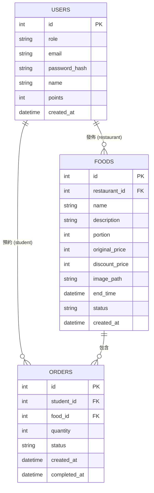

# 資料庫設計文件 (DB Design)

## 1. ER 圖（實體關係圖）

## 2. 資料表詳細說明

### 2.1 Users（使用者表）
儲存系統中所有使用者的資料，包含學生、餐廳與管理員。

| 欄位名稱 | 型別 | 必填 | 說明 |
| --- | --- | --- | --- |
| `id` | INTEGER | 是 | Primary Key, 自動遞增 |
| `role` | VARCHAR(50) | 是 | 身份角色 (`student` / `restaurant` / `admin`) |
| `email` | VARCHAR(120) | 是 | 登入信箱（校內信箱等），須唯一 |
| `password_hash`| VARCHAR(255)| 是 | Hash 加密後的密碼 |
| `name` | VARCHAR(100) | 是 | 學生姓名或餐廳名稱 |
| `points` | INTEGER | 否 | 積分系統，預設為 0 |
| `created_at` | DATETIME | 是 | 帳號建立時間 |

### 2.2 Foods（剩食餐點表）
儲存餐廳發佈的剩食資訊，與使用者表存在一對多關聯。

| 欄位名稱 | 型別 | 必填 | 說明 |
| --- | --- | --- | --- |
| `id` | INTEGER | 是 | Primary Key, 自動遞增 |
| `restaurant_id`| INTEGER | 是 | Foreign Key, 對應 `users.id` |
| `name` | VARCHAR(100) | 是 | 剩食餐點名稱 |
| `description` | TEXT | 否 | 餐點描述與說明 |
| `portion` | INTEGER | 是 | 發佈的剩餘份量 |
| `original_price`| INTEGER | 否 | 餐點原價 |
| `discount_price`| INTEGER | 否 | 優惠價格（免費則填 0） |
| `image_path` | VARCHAR(255)| 否 | 圖片相對路徑（如 `static/images/uploads/...`） |
| `end_time` | DATETIME | 是 | 預計下架時間 |
| `status` | VARCHAR(50) | 是 | 餐點狀態 (`available`, `out_of_stock`, `expired` 等) |
| `created_at` | DATETIME | 是 | 發佈時間 |

### 2.3 Orders（預約訂單表）
儲存學生的取餐預約資訊，作為學生與剩食餐點之間的多對多關聯中介。

| 欄位名稱 | 型別 | 必填 | 說明 |
| --- | --- | --- | --- |
| `id` | INTEGER | 是 | Primary Key, 自動遞增 |
| `student_id` | INTEGER | 是 | Foreign Key, 對應 `users.id` |
| `food_id` | INTEGER | 是 | Foreign Key, 對應 `foods.id` |
| `quantity` | INTEGER | 是 | 預約份量 |
| `status` | VARCHAR(50) | 是 | 訂單狀態 (`reserved`, `completed`, `cancelled`) |
| `created_at` | DATETIME | 是 | 訂單建立時間 |
| `completed_at` | DATETIME | 否 | 取餐核銷完成時間 |

## 3. SQL 建表語法
見專案的 `database/schema.sql`。

## 4. Python Model 程式碼
依據架構設計，本專案採用 Flask + SQLAlchemy 作為 ORM 工具。
模型程式碼已實作並存放於 `app/models/` 內。
