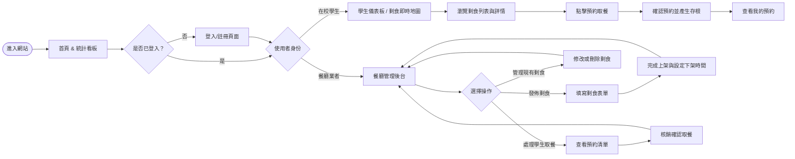
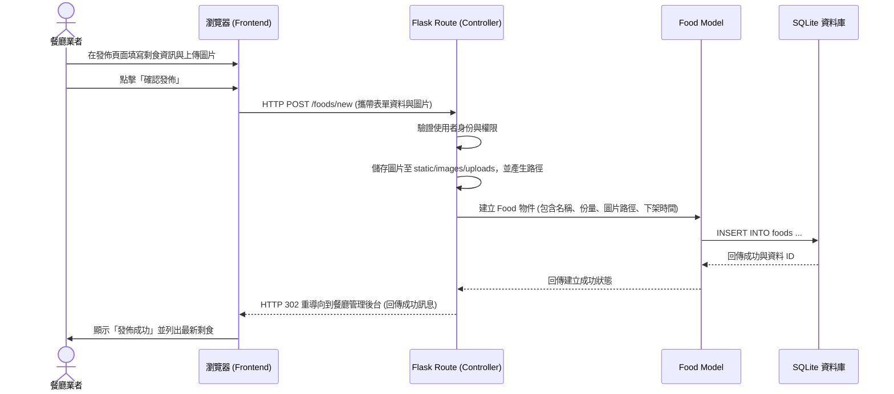

# 流程圖與系統流程設計 - 校園惜食匹配系統

本文件根據產品需求文件 (PRD) 與系統架構設計 (ARCHITECTURE)，視覺化使用者的操作路徑與後端資料流。

## 1. 使用者流程圖（User Flow）

以下流程圖說明不同角色（學生需求端、餐廳供應端）在系統上的主要操作路徑。

---

## 2. 系統序列圖（Sequence Diagram）

以下列出核心功能：「餐廳業者新增剩食」從前端操作到後端資料庫儲存的完整交互流程。

---

## 3. 功能清單對照表

本表列出系統主要功能及其對應的 URL 路徑規劃與使用的 HTTP 方法：

| 功能模組 | 功能描述 | URL 路徑 | HTTP 方法 |
| :--- | :--- | :--- | :--- |
| **首頁與統計** | 首頁與減碳/惜食量統計看板 | `/` | GET |
| **認證授權** | 使用者登入 (校內信箱驗證) | `/auth/login` | GET / POST |
| **認證授權** | 使用者註冊 | `/auth/register` | GET / POST |
| **認證授權** | 使用者登出 | `/auth/logout` | GET |
| **剩食 (餐廳端)** | 新增發佈剩食 (含上傳圖片) | `/foods/new` | GET / POST |
| **剩食 (餐廳端)** | 編輯或刪除剩食 | `/foods/<id>/edit` | GET / POST |
| **剩食 (學生端)** | 查看所有進行中的剩食 (列表與地圖) | `/foods` | GET |
| **剩食 (學生端)** | 檢視特定剩食詳細資訊 | `/foods/<id>` | GET |
| **預約 (學生端)** | 預約該項剩食 | `/foods/<id>/reserve` | POST |
| **預約 (學生端)** | 學生查看自己的預約紀錄 | `/orders/my` | GET |
| **預約 (餐廳端)** | 餐廳查看並核銷學生的預約訂單 | `/orders/manage` | GET / POST |
